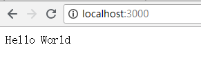

用法与express的用法很相似，但是也有区别    
首先起一个最简单的服务    
```javascript
let Koa = require('koa')
let app = new Koa()
app.use((ctx, next) => {
  ctx.body = 'hello'
})
app.listen(3000)
```    
这里一个最简单的服务就起好了，打开浏览器`localhost:3000`可以看到一个hello。    
上述代码可以看到koa有连个方法 listen use 他们与express中listen 和use的意思是一样的，listen用来监听端口，use用来使用中间件。但是koa的不同在于它原生没有继承路由，如果需要路由需要引入路由中间件。这个后续在讲。再看use方法的回掉函数。它的参数也和express有所不同，express的参数是res，req，next 而到了koa 它只有一ctx和next。当时koa的ctx里面封装了原生的res req 同时也封装了自己的两个属性，request和response。    
express中返回数据有一个方法 res.send()，再koa中可以为ctx.body赋值达到相同的效果，而且ctx.body可以被多次调用。然后当所有的中间件执行完成之后，把ctx.body的内容拿出来，调用res.send(),但是多次调用的值只会取最后一次的。     
```javascript
app.use((ctx, next) => {
  ctx.body = 'hello'
  //body 可以被多次调用
  ctx.body = 'world'
  // 多次掉用body 去最后一次的值
})
```    
    
打印除了最后一次赋值的world    
koa在ctx上面还封装了很多其他的方法，具体可以看[官方文档](https://koa.bootcss.com/)      
中间件还有个不同之处就是对异步的处理上的不同。在说异步的处理之前就要先说一下洋葱模型。