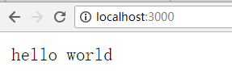
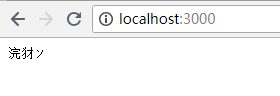

Node中的http模块可以快速为我们提供一个http服务。    
这篇文章就来摸一摸它那些常用API的用法    
先起一个最基础的服务Hello World一下：    
```javascript
//引入http模块
let http = require('http')
// 通过createServer()创建一个服务
let server = http.createServer()
//监听request事件，也就是收到请求的时候
server.on('request', function(req, res) {
  //响应体里写入hello world，回复给浏览器
  res.end('hello world')
})
//服务在本地3000端口监听
server.listen(3000, function() {
  //这个回调会在服务启动成功后被调用
  console.log('server start 3000')
})
```    
运行上述代码，然后打开浏览器`localhost:3000`    
    
那么如果把我hello world 改成 你好：    
```javascript
server.on('request', function(req, res) {
  //响应体里写入hello world，回复给浏览器
  res.end('你好')
})
```   
    
恭喜获得一堆乱码。   
主要还是编码问题，简单设置一下：    
```javascript
server.on('request', function(req, res) {
    //设置响应头，设置编码格式
  res.setHeader('Content-Type', 'text/plain;charset=utf-8')
  res.end('你好')
})
```   
    
通过setHeader的方式告诉浏览器需要被解析的编码格式，不过设置响应头还可以通过writeHead的方式设置：    
```javascript
server.on('request', function(req, res) {
  res.writeHead(200,{
    'Content-Type': 'text/plain;charset=utf-8'
  })
  res.end('你好')
})
```   
setHeader和writeHead区别在于，设置多个请求头的时候，setHeader由于一次只能设置一个所以需要而且允许被多次调用，writeHead只能调用一次。而且如果你调用了writeHead,在此之后你还要调用了setHeader就直接报错了，因为writeHead之后就不允许再设置头了。所以一般会建议使用setHeader比较灵活一些.   
更多API可以参考[官方文档](https://nodejs.org/dist/latest-v10.x/docs/api/http.html#http_class_http_serverresponse)     

接下去再来讲讲另外一个参数req 也就是request，请求。req只要你合理调用API可以获得一切你想知道的关于请求的信息