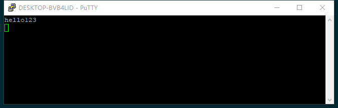

# TCP在Nodejs中的使用
本文不具体将TCP的细节，只是讲讲在nodejs中怎么用它原生实现的TCP模块`net`
首先起一个最简单的示例:
```javascript
//引入net模块
let net = require('net')
//调用net上的createServer方法创建一个服务
let server = net.createServer()
//server是基于node的EventEmiter,可以通过监听事件的方法来进行操作
server.on('connection', function() {
  console.log('hello')
})
//server在某个端口监听
server.listen(3000)
```   

上面这么多代码就已经把TCP的服务启动起来了，可以用putty测试一下。
   

如果一切正确，在点击了`open`之后控制面板就会出现`hello`
   

既然是网络模块，那就必然涉及到数据的交互。我们这里`connection`这个事件的回调函数来做数据的交互   
```javascript
//省略前半代码
server.on('connection', function(socket) {
  //socket是一个Duplex 可读可写
  socket.write('hello')
  //设置编码
  socket.setEncoding('utf8')
  // 可以通过流的方式接收到数据
  socket.on('data', function(data) {
    console.log(data)
  })
})
//省略后部分代码
```   
起一下服务，用putty访问一下   
   
看到欢迎信息`hello`,输入要发给服务端的内容`哈哈`，`嘿嘿`。    
然后打开服务端看一下   
    
确实输出了`哈哈`，`嘿嘿`   
那么既然打开了服务，那么如何关闭服务呢？   
net模块提供了两种方式去关闭服务    
1. close()    
```javascript
//省略引入代码
server.on('connection', function(socket) {
  //socket是一个Duplex 可读可写
  socket.write('hello')
  //设置编码
  socket.setEncoding('utf8')
  // 可以通过流的方式接收到数据
  socket.on('data', function(data) {
    console.log(data)
    server.close() 
  })
})
//监听close事件
server.on('close', function() {
  console.log('服务器关闭')
})
//省略监听代码
```    
服务会在一次输入后关闭
    
服务端成功打印出输入的内容    
    
然后再打开一个新的putty去访问服务    
    
服务被拒绝了，因为服务已经关闭了   
    
控制台打印出了close事件的log
用close去关闭服务的特性是，触发之后将同时会触发close事件。不会接受新的请求，但是当前连接可以继续发生消息。
2. unref()    
```javascript
//省略引入代码
server.on('connection', function(socket) {
  //socket是一个Duplex 可读可写
  socket.write('hello')
  //设置编码
  socket.setEncoding('utf8')
  // 可以通过流的方式接收到数据
  socket.on('data', function(data) {
    console.log(data)
    server.unref()
  })
})
//监听close事件
server.on('close', function() {
  console.log('服务器关闭')
})
//省略监听代码
```    
照例用putty打开一次    
   
再打开一个,与close不一样，它没有被拒绝   
    
再看看服务端   
    
123和456都被打印了出来，而且现在两个服务都还是处于连接状态，可以继续输入。当我们把两个窗口都关闭之后    
    
程序退出了。这就是unref的特性，只有当所有的客户端都关闭了之后，才会退出服务端    


不过除此之外，服务端也可以通过直接调用socket.end()直接关闭服务端    
更多API可以参考[net模块](https://nodejs.org/dist/latest-v10.x/docs/api/net.html)